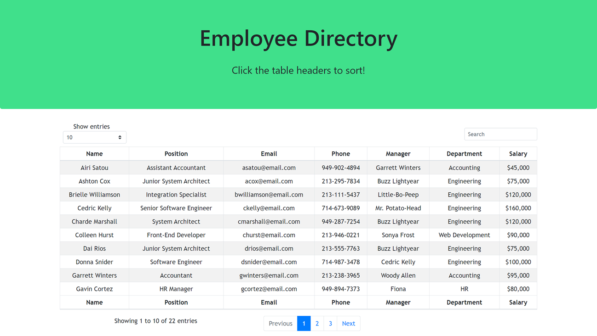

# React-Employee-Directory

[Deployed Application](https://cburkett22.github.io/React-Employee-Directory/)

## Description
As a Full-Stack Web Developer, I have created an application that will allow a user to view an entire employee directory at once. I have created this application so that the user has quick access to their information. In order to achieve this, I will implement a React application and a Material Design Bootstrap table.

## Table of Contents

* [Title](#Title)
* [Description](#Description)
* [Usage](#Usage)

## Usage
Click on the table headers to sort!

## Questions
Email: Coreyburkett22@gmail.com

